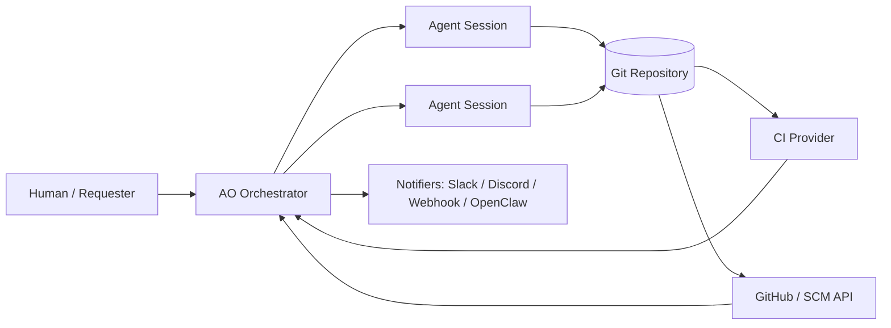
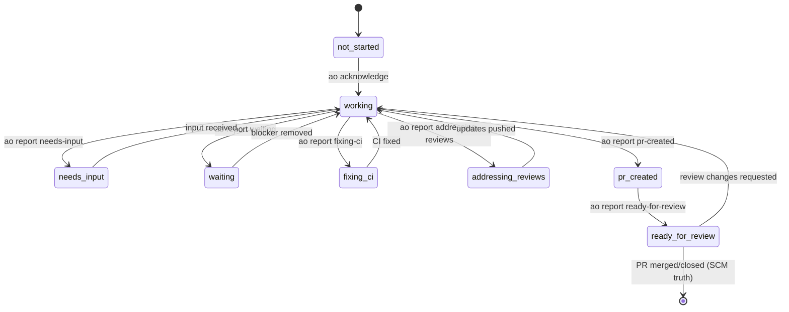
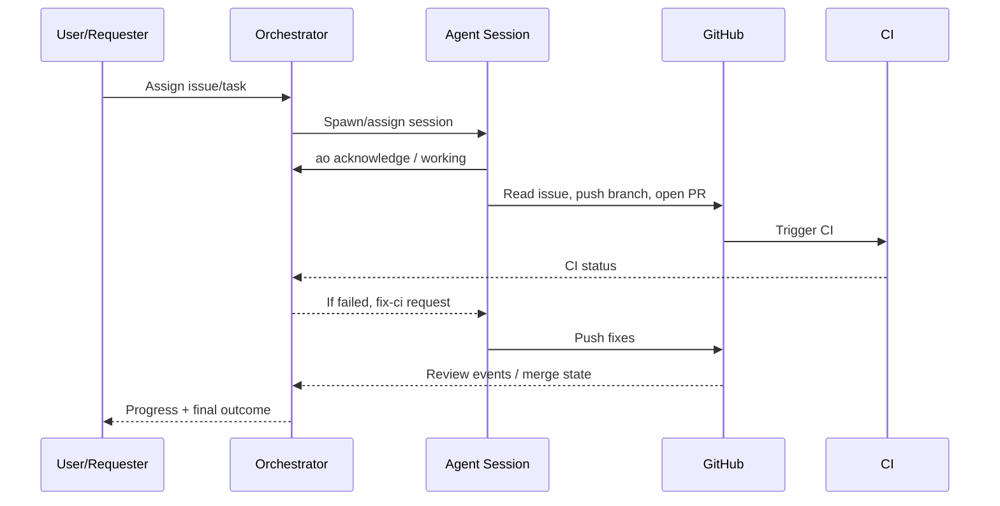

# Agent Orchestrator (AO) Architecture

## 1. Purpose
Agent Orchestrator (AO) coordinates autonomous coding agents across source control, CI, and human review loops. It turns high-level tasks into managed agent sessions, tracks lifecycle state, and keeps status synchronized with repository ground truth.

## 2. System Context

## 3. Core Components

### 3.1 Orchestrator Control Plane
- Receives tasks and maps them to project/repo context.
- Allocates managed sessions/worktrees.
- Tracks agent state using explicit reports and inferred runtime signals.
- Handles reassignment, pause/resume, and reviewer/CI event routing.

### 3.2 Agent Runtime (Managed Session)
- Runs in an isolated worktree with repo metadata and AO session variables.
- Executes shell/git/tooling commands to implement tasks.
- Sends lifecycle reports using AO CLI (`ao report ...`).
- Communicates blockers/escalations with `ao send at-orchestrator`.

### 3.3 Workspace & VCS Layer
- Git worktree per active agent session.
- Branch conventions tie work to tracker items (e.g., `feat/102`).
- Commit history uses conventional commits.
- PR workflow used for integration and review.

### 3.4 SCM Integration (GitHub)
- Reads issues/PRs.
- Opens/updates PRs from agent branches.
- Captures review events and PR state transitions.
- Uses SCM truth for terminal states (merged/closed).

### 3.5 CI Integration
- CI results are consumed by orchestrator.
- Failures trigger “fixing-ci” execution loop.
- Green checks gate review readiness.

### 3.6 Notification Layer
- Pluggable outputs: Discord, Slack, webhook, OpenClaw.
- Best-effort notifications; missing config degrades gracefully.

### 3.7 Status & Activity Log
- Session activity persisted in local AO metadata (e.g., `.ao/activity.jsonl`).
- State transitions combine:
  1. Explicit agent reports (`working`, `needs-input`, etc.)
  2. Runtime liveness/activity inference
  3. SCM/CI events

## 4. Session Lifecycle Model

## 5. Execution Workflow

1. **Task intake**
   - Orchestrator receives assignment (issue/task/reviewer feedback).
2. **Session bootstrapping**
   - Creates/assigns worktree and session metadata.
3. **Agent execution**
   - Agent acknowledges task, inspects context, implements changes.
4. **Git/PR phase**
   - Agent creates branch, commits, pushes, opens PR.
5. **Validation loop**
   - CI failures or review feedback are routed back to same session.
6. **Completion**
   - Terminal PR state resolved by SCM; orchestrator finalizes tracking.

## 6. Agent-Orchestrator Contract

### 6.1 Agent Responsibilities
- Follow task scope and repo conventions.
- Keep status current via AO reports.
- Escalate true blockers only when self-resolution is impossible.
- Do not self-assert terminal repository outcomes (merged/closed).

### 6.2 Orchestrator Responsibilities
- Session provisioning and routing.
- State inference and conflict resolution between weak/strong signals.
- CI/review event delivery to active agent.
- Cross-session coordination and reassignment.

## 7. Control Signals and Priority

AO resolves state from multiple signal classes:
1. **Ground-truth external events** (SCM merged/closed, CI failure) — highest authority.
2. **Fresh explicit agent reports** — preferred operational truth.
3. **Heuristic runtime inference** (activity, process death) — fallback.

## 8. Failure & Recovery Patterns

- **Issue/PR not accessible**: agent reports `needs-input`, pings orchestrator, waits reassignment.
- **CI red**: agent switches to `fixing-ci`, applies fixes, pushes.
- **Review change requests**: agent switches to `addressing-reviews`, resolves each comment.
- **Notification outages**: no functional block; observability degraded only.

## 9. Security and Safety Boundaries

- Per-session workspace isolation via worktrees.
- Principle of least privilege via configured tokens/scopes.
- Explicit escalation path for actions outside normal sandboxing.
- Auditability through command history, activity logs, commit/PR trace.

## 10. Extensibility Points

- Additional SCM/CI providers.
- Additional notifier backends.
- Policy plugins for branch naming, commit linting, and merge gates.
- Multi-agent orchestration primitives for parallel decomposition.

## 11. Minimal Sequence (End-to-End)

## 12. Verification Checklist (for reviewers)

- [ ] Architecture covers control plane, runtime, SCM, CI, notifications, and state model.
- [ ] Lifecycle states and transitions are internally consistent.
- [ ] Responsibilities between agent and orchestrator are clearly separated.
- [ ] Failure handling and escalation paths are documented.
- [ ] Diagram flow matches textual workflow.

---

This document is platform-agnostic and describes AO behavior as an operational architecture model suitable for implementation, audit, and onboarding.
