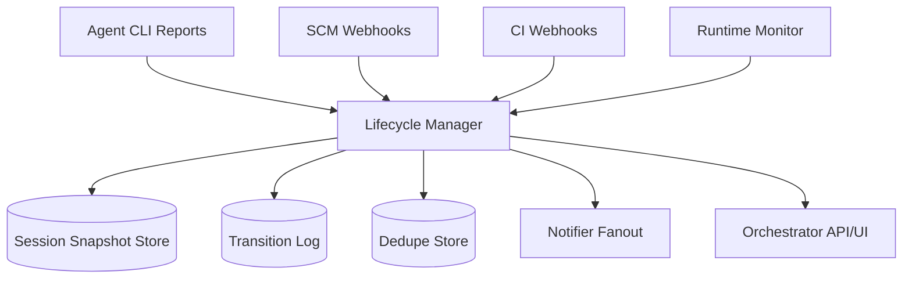
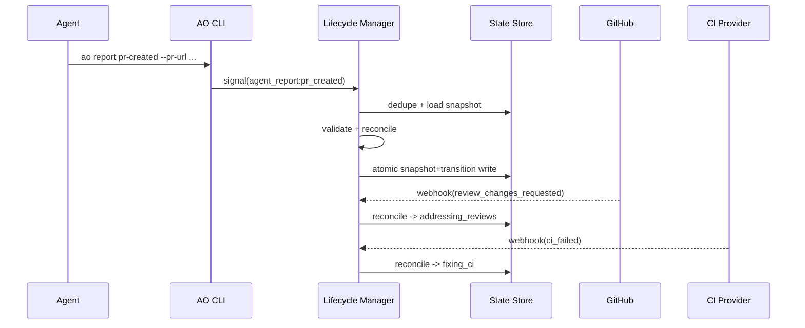

# AO Lifecycle Manager — Complete Technical Architecture & Implementation Guide

## 1) What the Lifecycle Manager Is

The **Lifecycle Manager** is the AO subsystem that computes and persists the authoritative state of each agent session.

It answers:
- Is the session actively executing work?
- Is it waiting for user input?
- Is it in a CI-fixing or review-addressing loop?
- Has PR creation/review readiness been reached?
- Did external systems (SCM/CI) change reality?

Conceptually, it is a **state machine + signal reconciliation engine + audit log**.

---

## 2) Design Goals

1. **Correctness first**: external truth must override stale local assumptions.
2. **Determinism**: same signal sequence => same final state.
3. **Auditability**: every transition is explainable and queryable.
4. **Resilience**: duplicates/out-of-order events must be safe.
5. **Operational clarity**: explicit reports are preferred over heuristics.

---

## 3) Canonical State Model

```text
not_started
working
needs_input
waiting
fixing_ci
addressing_reviews
pr_created
ready_for_review
idle
```

`stuck`-like conditions are usually inferred overlays/annotations, not a strong terminal business state.

### High-level transitions
- `ao acknowledge` => `working`
- `ao report needs-input` => `needs_input`
- `ao report waiting` => `waiting`
- `ao report fixing-ci` => `fixing_ci`
- `ao report addressing-reviews` => `addressing_reviews`
- `ao report pr-created` => `pr_created`
- `ao report ready-for-review` => `ready_for_review`
- CI failure/review-change events can move state back to active remediation loops.

---

## 4) Architecture Overview



### Core subcomponents
1. **Ingress adapters** (CLI/SCM/CI/runtime)
2. **Normalizer** (common signal envelope)
3. **Reconciler** (priority + transition-policy + staleness checks)
4. **Persistence** (atomic snapshot + append-only transition log)
5. **Publisher** (UI/notifier updates)

---

## 5) Signal Model (Data Contracts)

## 5.1 Unified Signal Envelope

```json
{
  "session_id": "at-2",
  "signal_type": "agent_report|scm_event|ci_event|runtime_inference",
  "signal_name": "working|pr_created|ci_failed|pr_merged|heartbeat_timeout",
  "source": "agent_cli|github_webhook|ci_webhook|runtime_monitor",
  "event_time": "2026-05-26T01:20:00Z",
  "ingest_time": "2026-05-26T01:20:01Z",
  "payload": {
    "pr_url": "https://github.com/org/repo/pull/1",
    "sha": "a534723...",
    "ci_run_id": "12345"
  },
  "idempotency_key": "stable-hash"
}
```

## 5.2 Session Snapshot

```json
{
  "session_id": "at-2",
  "current_state": "ready_for_review",
  "state_version": 37,
  "updated_at": "2026-05-26T01:30:00Z",
  "last_authoritative_signal": {
    "signal_type": "agent_report",
    "signal_name": "ready_for_review",
    "event_time": "2026-05-26T01:29:58Z"
  },
  "linked_pr": {
    "url": "https://github.com/org/repo/pull/1",
    "number": 1,
    "head_sha": "a534723..."
  },
  "annotations": {
    "latest_ci_status": "success",
    "latest_review_status": "pending",
    "needs_human_input_reason": null
  }
}
```

## 5.3 Transition Log Record

```json
{
  "session_id": "at-2",
  "from_state": "working",
  "to_state": "pr_created",
  "reason": "agent_report:pr_created",
  "signal_id": "sig-123",
  "applied_at": "2026-05-26T01:22:41Z",
  "state_version": 34
}
```

---

## 6) Reconciliation Semantics (Technical Core)

### 6.1 Priority Order
1. **External ground truth** (SCM terminal and definitive CI signals)
2. **Fresh explicit agent reports**
3. **Runtime inferences** (timeouts/heuristics)

### 6.2 Deterministic reconcile loop

```python
def reconcile(snapshot, signal):
    if dedupe.exists(signal.idempotency_key):
        return snapshot

    if not validate(signal):
        reject(signal, "invalid_signal")
        return snapshot

    target = map_signal_to_state(signal)

    if not transition_policy.allows(snapshot.current_state, signal):
        reject(signal, "invalid_transition")
        return snapshot

    if is_stale(signal, snapshot.last_authoritative_signal):
        shadow(signal, "stale")
        return snapshot

    if is_lower_priority_conflict(signal, snapshot):
        shadow(signal, "priority_conflict")
        return snapshot

    next_snapshot = apply(snapshot, target, signal)
    tx.persist(next_snapshot, transition_record(snapshot, next_snapshot, signal))
    publish(next_snapshot)
    return next_snapshot
```

### 6.3 Why this works
- **Idempotency** handles duplicate deliveries.
- **Staleness suppression** handles out-of-order arrival.
- **Priority conflict checks** prevent weak signals from overriding stronger truth.

---

## 7) Transition Policy Design

Represent policy as a pure function or table-driven matrix.

Example (simplified):

| From | Signal | To |
|---|---|---|
| not_started | acknowledge | working |
| working | needs_input | needs_input |
| working | waiting | waiting |
| working | fixing_ci | fixing_ci |
| working | addressing_reviews | addressing_reviews |
| working | pr_created | pr_created |
| pr_created | ready_for_review | ready_for_review |
| ready_for_review | review_changes_requested | addressing_reviews |
| ready_for_review | ci_failed | fixing_ci |

Enforce constraints:
- Require PR URL when reporting `pr_created`/`ready_for_review`.
- Reject impossible regressions unless explicitly allowed by stronger external event.

---

## 8) Concurrency, Ordering, and Race Conditions

## 8.1 Common races
- Agent reports `ready_for_review` while CI webhook (`failed`) arrives concurrently.
- Review-change event arrives after a newer “working” report.

## 8.2 Mitigations
- **Per-session serialized processing queue** (recommended).
- OR optimistic concurrency using `state_version` compare-and-swap.
- Dedupe by `idempotency_key`.
- Strict ordering strategy:
  1. priority tier
  2. event_time
  3. ingest_time tie-breaker

---

## 9) Persistence Strategy

Minimum persistent models:
1. `session_snapshot` (authoritative current state)
2. `session_transition_log` (append-only audit)
3. `processed_signals` (idempotency ledger)
4. `session_links` (issue/branch/PR mapping)

Recommended guarantees:
- Single transaction for snapshot update + transition append.
- Unique index on `processed_signals.idempotency_key`.
- Monotonic `state_version`.

---

## 10) CLI Integration Contract

Lifecycle manager consumes AO CLI reports:
- `ao acknowledge`
- `ao report working`
- `ao report waiting`
- `ao report needs-input`
- `ao report fixing-ci`
- `ao report addressing-reviews`
- `ao report pr-created --pr-url <url>`
- `ao report ready-for-review --pr-url <url>`

Implementation notes:
- CLI should include `AO_SESSION_ID`.
- Report API should return explicit accepted/rejected response.
- Agent should retry transient failures with backoff.

---

## 11) SCM and CI Adapters

## 11.1 SCM Adapter
Consumes PR/review/merge webhooks and normalizes them into lifecycle signals.

Critical rules:
- PR merged/closed is external truth and cannot be superseded by stale local reports.
- Review “changes requested” should route session into remediation (`addressing_reviews`).

## 11.2 CI Adapter
Consumes pipeline run events tied to PR head SHA.

Critical rules:
- CI failure can assert remediation loop (`fixing_ci`).
- CI success is permissive, not terminal by itself.

---

## 12) Runtime Inference Engine

Used only as fallback when explicit/external signals are absent.

Inputs:
- command heartbeat timestamps
- process liveness
- shell output cadence

Typical heuristic:
- if `working` and no activity for threshold => infer `idle` (soft)

Heuristics must never override newer explicit or external signals.

---

## 13) Error Handling

1. **Duplicate signals**: ignore safely.
2. **Invalid payload**: reject + reason code.
3. **Storage failure**: no partial state mutation.
4. **Webhook transient failure**: retry with backoff + DLQ if needed.
5. **Notifier failure**: log only; do not roll back committed state.

---

## 14) Security and Trust Boundaries

- Verify webhook signatures.
- Restrict API tokens to least privilege.
- Treat all external payload fields as untrusted.
- Escape/validate before persistence/display.
- Keep immutable transition audit for incident investigations.

---

## 15) Observability Requirements

### Metrics
- transition_count by state and signal source
- reconcile_latency (p50/p95/p99)
- rejected_signal_count by reason
- stale_signal_suppression_count
- dedupe_hit_rate

### Logs
Structured logs should include:
- session_id
- signal_id / idempotency_key
- from_state / to_state
- apply_or_reject decision
- reason code

### Tracing
Trace each signal from ingress -> reconcile -> persist -> fanout.

---

## 16) Testing Strategy

## 16.1 Unit tests
- transition-policy matrix
- map_signal_to_state
- stale suppression
- priority conflict behavior
- idempotency handling

## 16.2 Integration tests
- CLI report to persisted state
- GitHub webhook to remediation state
- CI failure event and recovery loop

## 16.3 Resilience tests
- duplicate webhook storms
- out-of-order replay
- datastore transient errors
- notifier outages

## 16.4 Property tests
- no illegal transitions
- deterministic replay
- monotonic state_version growth

---

## 17) Coding Blueprint (Recommended Module Layout)

```text
lifecycle/
  domain/
    states.py
    signals.py
    transition_policy.py
  app/
    reconciler.py
    ingestion.py
    dispatch.py
  infra/
    store.py
    github_adapter.py
    ci_adapter.py
    notifier.py
    telemetry.py
  tests/
    unit/
    integration/
```

### Build order
1. Domain enums + transition policy (pure, test-first)
2. Reconciler service
3. Transactional persistence adapter
4. Ingress adapters (CLI/SCM/CI)
5. Publisher/notification fanout
6. Metrics/tracing/logging hardening

---

## 18) Minimal End-to-End Sequence



---

## 19) Runbook (Operations)

- Wrong displayed state? Check last transition-log entries first.
- Missing updates? Inspect webhook delivery and queue lag.
- State oscillation? Add debounce for inference-only transitions.
- Multi-session contention? Enforce single active owner lock per issue/PR mapping.

---

## 20) Definition of “Correct Lifecycle Behavior”

A correct lifecycle manager demonstrates:
1. Strong preference for explicit fresh reports.
2. External truth dominance for terminal/definitive signals.
3. No rollback from stale/out-of-order events.
4. Replay-safe idempotent processing.
5. Full forensic trail of why every transition happened.

---

## 21) Final Summary

The AO Lifecycle Manager is a **session truth authority**.  
Technically, it is successful when it provides deterministic reconciliation across competing asynchronous signals, stores every decision atomically and audibly, and allows operators/agents to trust that session state reflects reality rather than guesswork.

